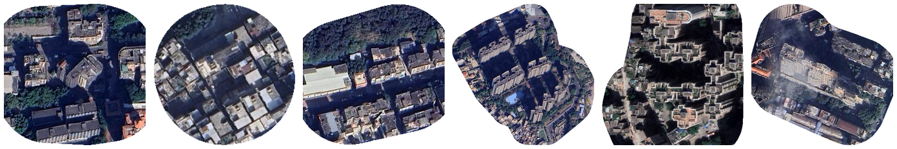

# GBA-GCs Controlled Access Request Portal

This repository is the controlled-access request portal for non-public components of the maintained GBA-GCs dataset release associated with the ECCV 2026 paper:

**Urban Boundaries, Social Barriers: A Benchmark and Vision-Centric Framework for Mapping Gated Communities and Equity Implications**.

The ECCV paper reports the original benchmark and experiments. The public and controlled repositories document a maintained release that is based on the paper dataset and further refined after acceptance, including expanded mainland AOI coverage and a separate Hong Kong/Macao diagnostic component.

The raw archives are **not hosted on GitHub**. This repository contains only:

- access policy
- data-use agreement template
- request form template
- manifest and checksums
- permitted-use and prohibited-use rules
- safe example schemas

Controlled components include AOI geometries, community names or provider identifiers when present, raw image chips, and provider-derived metadata. These files are distributed only after request review and signature of a non-commercial data-use agreement.

Contact: `m.zhao@connect.hkust-gz.edu.cn`

## Dataset Slice Preview

The preview below shows a small set of de-identified, low-resolution remote-sensing tile thumbnails from the controlled data format. These thumbnails are for documentation only. They do not include AOI IDs, names, addresses, coordinates, provider identifiers, or metadata, and they are not a substitute for access to the controlled archives.

  

The `data_sample/` folder provides three small preview records. Each sample includes:

- `metadata.json`: de-identified record metadata and label fields.
- `aoi_local.geojson`: AOI geometry in local normalized tile coordinates, not real-world coordinates.
- `remote_sensing_tile.png`: a stripped, low-resolution remote-sensing thumbnail.

Approved controlled access may provide full CRS-aware AOI geometries, image chips, provider-derived metadata, and human-label files under the DUA.

## How To Request Controlled Data

1. Review `docs/ACCESS_POLICY.md` and `docs/CONTROLLED_RELEASE_POLICY.md`.
2. Check `metadata/full_archive_manifest.csv` and `metadata/checksums_sha256.txt` to identify the components needed for your project.
3. Fill in `forms/ACCESS_REQUEST_FORM.md`.
4. Fill and sign `docs/DUA_TEMPLATE.md` using an institutional email and accountable institutional affiliation.
5. Send the completed request form and signed DUA to `m.zhao@connect.hkust-gz.edu.cn`. Do not upload signed DUAs, personal information, or sensitive research details to public GitHub issues.
6. If approved, the maintainers will provide access-controlled storage links for the approved archives.
7. Verify received archives against `metadata/checksums_sha256.txt` before use.

Requests should explain why the public anonymized release is insufficient and should request only the minimum controlled components required for the stated non-commercial research purpose.

## Repository Contents

- `docs/ACCESS_POLICY.md`: who may request access and how requests are reviewed.
- `docs/CONTROLLED_RELEASE_POLICY.md`: ethics, redistribution, storage, and publication rules.
- `docs/DUA_TEMPLATE.md`: controlled data-use agreement template.
- `docs/SECURITY_AND_STORAGE.md`: minimum handling requirements for approved users.
- `forms/ACCESS_REQUEST_FORM.md`: information requesters should provide.
- `metadata/full_archive_manifest.csv`: archive inventory and SHA-256 checksums.
- `metadata/checksums_sha256.txt`: checksum list for approved archive verification.
- `metadata/guangzhou_human_label_manifest.csv`: Guangzhou human-label inventory.
- `metadata/manifest.json`: count summary and access level.
- `data_sample/`: small de-identified JSON, AOI, and remote-sensing preview records.
- `examples/controlled_manifest_schema.csv`: example schema, no raw data.
- `examples/approved_use_cases.md`: examples of permitted and prohibited uses.

## Public Dataset

The unrestricted anonymized release is hosted separately:

https://github.com/MinweiZhao/GBA-GCs

## Public Model Checkpoint

The MCGC checkpoint is distributed through the public repository's GitHub Releases, not through this controlled-access documentation repository:

- Release: https://github.com/MinweiZhao/GBA-GCs/releases/tag/v2026-06-mcgc
- Direct download: https://github.com/MinweiZhao/GBA-GCs/releases/download/v2026-06-mcgc/trimodal_io_fused_gba_full.pth
- Asset: `trimodal_io_fused_gba_full.pth`
- Size: 1,716,771,558 bytes
- SHA-256: `48518dafd9b2e2702db812ae9977bc6699bbc2e55c4a8044bd7d993114ebb1b8`

Controlled raw data access remains subject to DUA review. The public checkpoint does not grant permission to redistribute AOI polygons, names, provider identifiers, raw image chips, or provider-derived metadata.

## Access Principle

The project supports reproducible non-commercial research while minimizing risks of residential targeting, surveillance, re-identification, and violation of third-party data terms. Approved users may analyze controlled files only under the DUA and may publish only aggregate, privacy-preserving outputs.
